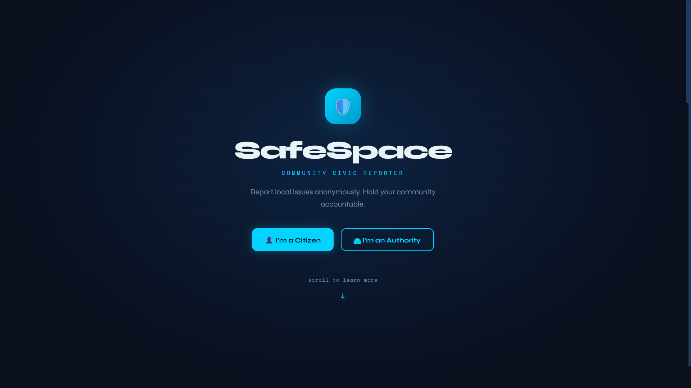

<p align="center">
  
</p>

# [Project Name] 🎯

## Basic Details

### Team Name: [Name]

### Team Members
- Member 1: Shreya Ajith - LBS Institute of Technology for Women
- Member 2: Pavithra K M- LBS Institute of Technology for Women

### Hosted Project Link
https://shreyalbs.github.io/SafeSpace/


### Project Description
SafeSpace transforms silent civic frustration into collective action by giving every citizen a safe voice to report issues, amplify urgent concerns through community support, and drive transparent resolution from authorities.

### The Problem statement
Urban cities like Kochi face thousands of unresolved civic issues daily — potholes, broken streetlights, garbage dumps, and safety hazards — simply because there is no simple, direct way for citizens to report them to the right authority. The existing process is bureaucratic, time-consuming, and discouraging, causing most people to stay silent. Meanwhile, authorities have no structured system to receive and prioritize complaints from the public, leaving critical issues unaddressed for months. SafeSpace solves this by providing a two-sided platform where citizens can report issues anonymously in seconds and route them directly to the responsible authority, while authorities get a clean dashboard to manage, filter, and resolve complaints efficiently.

### The Solution
SafeSpace is a two-sided civic reporting platform where citizens anonymously report local issues in seconds — with photo, location, and category — routed directly to the responsible authority. Authorities receive a structured dashboard to filter, search, and resolve complaints efficiently, closing the loop between the public and the people who can act.

## Technical Details

### Technologies/Components Used

**For Software:**
- Languages used: HTML, CSS, JavaScript
- Frameworks used: None
- Libraries used: Google Fonts (Syne, Space Mono)
- Tools used: VS Code, Live Server, Browser DevTools

**For Hardware:**
- Main components: None
- Specifications: None
- Tools required: None

---

## Features

List the key features of your project:
- Feature 1: Dual Interface — Separate portals for Citizens and Authorities, each designed for their specific needs
- Feature 2: Anonymous Reporting — Citizens can report issues without revealing their identity
- Feature 3: Photo Upload — Citizens can attach photographic evidence to strengthen their report
- Feature 4: Community Upvoting — Citizens can upvote existing reports to signal urgency to authorities


---

## Implementation

### For Software:

#### Installation
```bash
[Installation commands - e.g., npm install, pip install -r requirements.txt]
```

#### Run
```bash
[Run commands - e.g., npm start, python app.py]
```

### For Hardware:

#### Components Required
[List all components needed with specifications]

#### Circuit Setup
[Explain how to set up the circuit]

---

## Project Documentation

### For Software:

#### Screenshots (Add at least 3)


<p align="center">
  
</p>
Home Page or the Landing page of our website SafeSpace


<p align="center">
  
</p>
Shows the user interface where user can see each issue reported in each category, upvote in issues and 
is known reporting the issue.


<p align="center">
  
</p>
Here there is form for reporting the issue for user which includes features like location,which authority the issue should be brought to notice and which category the issue belongs to and to provide description to the issue and submit photo if required.


<p align="center">
  
</p>
Here this is the Authority login , where each Authority get's their unique password.Then using default password the authority officials can login.


<p align="center">
  
</p>
This is the Authority interface , where authority can select their authority from drop down and resolve the issue and mark them , so that report no longer exits in User interface.


#### Diagrams

**System Architecture:**


<p align="center">
  
</p>
# SafeSpace System Architecture

## Components
**5-Layer Structure:**
- **User Layer:** Citizens (report issues) + Authorities (manage reports)
- **Frontend Layer:** `index.html` (structure), `style.css` (styling), `app.js` (logic)
- **Logic Layer:** State management (JS array), Navigation (CSS classes), Filters (real-time search), Form processor (submissions + photo base64)
- **Browser APIs:** FileReader (photo conversion), Intersection Observer (scroll animations), Clipboard API (copy text)
- **Output Layer:** Citizen Portal, Authority Portal, Stats Dashboard, Landing Page

## Data Flow
Load → Initialize seed reports → Citizen submits form → Photo converts to base64 → New report pushed to array → UI re-renders → Authority filters/searches → Marks resolved → Array updates → UI refreshes instantly

## Tech Stack
- HTML loads CSS (link) + JS (script)
- CSS defines variables, styles, `.fade-section`/`.visible` for animations
- JS manipulates DOM (`getElementById`, `innerHTML`), applies dynamic inline styles, calls Browser APIs
- Google Fonts via CDN
- **100% client-side** — no server, no database, no build tools


**Application Workflow:**


*Add caption explaining your workflow*

---

### For Hardware:

#### Schematic & Circuit


*Add caption explaining connections*


*Add caption explaining the schematic*

#### Build Photos


<p align="center">
  
</p>

*List out all components shown*


*Explain the build steps*


*Explain the final build*

---

## Additional Documentation

### For Web Projects with Backend:

#### API Documentation

**Base URL:** `https://api.yourproject.com`

##### Endpoints

**GET /api/endpoint**
- **Description:** [What it does]
- **Parameters:**
  - `param1` (string): [Description]
  - `param2` (integer): [Description]
- **Response:**
```json
{
  "status": "success",
  "data": {}
}
```

**POST /api/endpoint**
- **Description:** [What it does]
- **Request Body:**
```json
{
  "field1": "value1",
  "field2": "value2"
}
```
- **Response:**
```json
{
  "status": "success",
  "message": "Operation completed"
}
```

[Add more endpoints as needed...]

---

### For Mobile Apps:

#### App Flow Diagram


*Explain the user flow through your application*

#### Installation Guide

**For Android (APK):**
1. Download the APK from [Release Link]
2. Enable "Install from Unknown Sources" in your device settings:
   - Go to Settings > Security
   - Enable "Unknown Sources"
3. Open the downloaded APK file
4. Follow the installation prompts
5. Open the app and enjoy!

**For iOS (IPA) - TestFlight:**
1. Download TestFlight from the App Store
2. Open this TestFlight link: [Your TestFlight Link]
3. Click "Install" or "Accept"
4. Wait for the app to install
5. Open the app from your home screen

**Building from Source:**
```bash
# For Android
flutter build apk
# or
./gradlew assembleDebug

# For iOS
flutter build ios
# or
xcodebuild -workspace App.xcworkspace -scheme App -configuration Debug
```

---

### For Hardware Projects:

#### Bill of Materials (BOM)

| Component | Quantity | Specifications | Price | Link/Source |
|-----------|----------|----------------|-------|-------------|
| Arduino Uno | 1 | ATmega328P, 16MHz | ₹450 | [Link] |
| LED | 5 | Red, 5mm, 20mA | ₹5 each | [Link] |
| Resistor | 5 | 220Ω, 1/4W | ₹1 each | [Link] |
| Breadboard | 1 | 830 points | ₹100 | [Link] |
| Jumper Wires | 20 | Male-to-Male | ₹50 | [Link] |
| [Add more...] | | | | |

**Total Estimated Cost:** ₹[Amount]

#### Assembly Instructions

**Step 1: Prepare Components**
1. Gather all components listed in the BOM
2. Check component specifications
3. Prepare your workspace

*Caption: All components laid out*

**Step 2: Build the Power Supply**
1. Connect the power rails on the breadboard
2. Connect Arduino 5V to breadboard positive rail
3. Connect Arduino GND to breadboard negative rail

*Caption: Power connections completed*

**Step 3: Add Components**
1. Place LEDs on breadboard
2. Connect resistors in series with LEDs
3. Connect LED cathodes to GND
4. Connect LED anodes to Arduino digital pins (2-6)

*Caption: LED circuit assembled*

**Step 4: [Continue for all steps...]**

**Final Assembly:**

*Caption: Completed project ready for testing*

---

### For Scripts/CLI Tools:

#### Command Reference

**Basic Usage:**
```bash
python script.py [options] [arguments]
```

**Available Commands:**
- `command1 [args]` - Description of what command1 does
- `command2 [args]` - Description of what command2 does
- `command3 [args]` - Description of what command3 does

**Options:**
- `-h, --help` - Show help message and exit
- `-v, --verbose` - Enable verbose output
- `-o, --output FILE` - Specify output file path
- `-c, --config FILE` - Specify configuration file
- `--version` - Show version information

**Examples:**

```bash
# Example 1: Basic usage
python script.py input.txt

# Example 2: With verbose output
python script.py -v input.txt

# Example 3: Specify output file
python script.py -o output.txt input.txt

# Example 4: Using configuration
python script.py -c config.json --verbose input.txt
```

#### Demo Output

**Example 1: Basic Processing**

**Input:**
```
This is a sample input file
with multiple lines of text
for demonstration purposes
```

**Command:**
```bash
python script.py sample.txt
```

**Output:**
```
Processing: sample.txt
Lines processed: 3
Characters counted: 86
Status: Success
Output saved to: output.txt
```

**Example 2: Advanced Usage**

**Input:**
```json
{
  "name": "test",
  "value": 123
}
```

**Command:**
```bash
python script.py -v --format json data.json
```

**Output:**
```
[VERBOSE] Loading configuration...
[VERBOSE] Parsing JSON input...
[VERBOSE] Processing data...
{
  "status": "success",
  "processed": true,
  "result": {
    "name": "test",
    "value": 123,
    "timestamp": "2024-02-07T10:30:00"
  }
}
[VERBOSE] Operation completed in 0.23s
```

---

## Project Demo

### Video
[Add your demo video link here - YouTube, Google Drive, etc.]

*Explain what the video demonstrates - key features, user flow, technical highlights*

### Additional Demos
[Add any extra demo materials/links - Live site, APK download, online demo, etc.]

---

## AI Tools Used (Optional - For Transparency Bonus)

Chatgpt,Claude,Gemini,Copilot

**Tool Used:** [e.g., GitHub Copilot, v0.dev, Cursor, ChatGPT, Claude]

**Purpose:** [What you used it for]
-  To generate System Architecture layout
-  Brainstorming and refining ideas
-  Code review and optimization suggestions

**Key Prompts Used:**
- "Create a REST API endpoint for user authentication"
- "Debug this async function that's causing race conditions"
- "Optimize this database query for better performance"

**Percentage of AI-generated code:** 75% ,rest we debugged and we added and edited.

**Human Contributions:**
- Architecture design and planning
- Custom business logic implementation
- Integration and testing
- UI/UX design decisions

*Note: Proper documentation of AI usage demonstrates transparency and earns bonus points in evaluation!*

---

## Team Contributions

- Shreya Ajith: Frontend Development,UI/UX design,Documentation
- Pavithra K M: Backend development,Testing,Documentation,System Design

---

## License

This project is licensed under the [LICENSE_NAME] License - see the [LICENSE](LICENSE) file for details.

**Common License Options:**
- MIT License (Permissive, widely used)
- Apache 2.0 (Permissive with patent grant)
- GPL v3 (Copyleft, requires derivative works to be open source)

---

Made with ❤️ at TinkerHub
